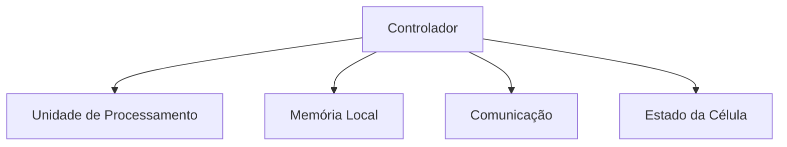
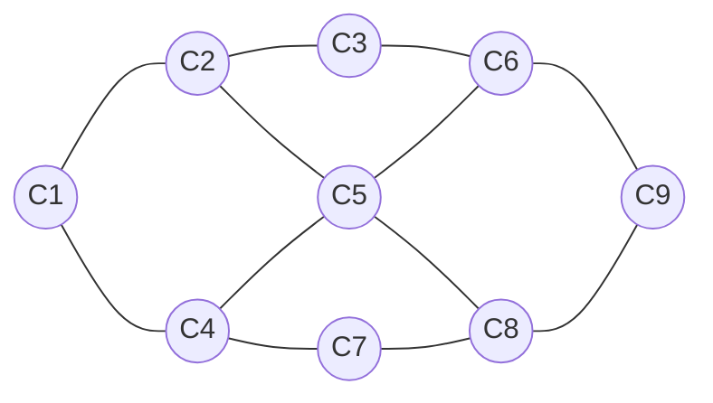

# ACS

## Arquitetura Celular Silva

> Uma proposta de arquitetura computacional baseada em células autônomas e distribuídas.

---

### Apresentação

Imagine…

Imagine um computador que não dependa de um processador central.

Imagine um sistema em que cada pequena unidade seja capaz de processar informações, armazenar dados e cooperar com as demais.

Imagine um computador que continue funcionando mesmo quando parte de sua estrutura falha, reorganizando-se automaticamente.

A maioria dos computadores modernos ainda segue o mesmo princípio fundamental: um processador central executa instruções, a memória armazena dados e barramentos conectam todos os componentes.

Mas… e se essa não for a única maneira de construir um computador?

A Arquitetura Celular Silva (ACS) é um projeto de pesquisa independente que propõe explorar uma arquitetura computacional baseada em células autônomas. Cada célula possui capacidade de processamento, memória e comunicação, trabalhando em conjunto com as demais para formar um único sistema distribuído.

Este projeto não pretende afirmar que essa arquitetura seja superior às atuais. Seu objetivo é estudar, desenvolver e documentar um novo modelo conceitual de arquitetura de computadores, inspirado na cooperação, na distribuição de tarefas e na capacidade de adaptação observadas em sistemas naturais.

Este repositório reúne ideias, estudos, diagramas, protótipos, simulações e documentação produzidos durante o desenvolvimento da ACS.

Se você gosta de arquitetura de computadores, sistemas distribuídos, hardware e novas formas de pensar a computação, seja bem-vindo.

---

## 01 — Contexto e Motivação

### Contexto

A história da computação é resultado da contribuição de diversos pesquisadores que estabeleceram os fundamentos da ciência da computação e da arquitetura de computadores. Ao longo das últimas décadas, esses estudos permitiram a criação de sistemas cada vez mais rápidos, confiáveis e eficientes.

Grande parte dos computadores atuais ainda é baseada nos princípios da arquitetura proposta por John von Neumann, modelo que revolucionou a computação ao organizar o sistema em unidades de processamento, memória e entrada/saída. Com o avanço da tecnologia, novas áreas de pesquisa surgiram para enfrentar desafios como desempenho, paralelismo, escalabilidade e tolerância a falhas.

Entre essas áreas destacam-se os sistemas distribuídos, a computação paralela, os autômatos celulares estudados por Stephen Wolfram e os sistemas adaptativos pesquisados por John Holland. Embora pertençam a campos diferentes, todos esses estudos demonstram que sistemas complexos podem surgir da cooperação entre unidades relativamente simples.

Durante o estudo desses temas surgiu uma reflexão: apesar da enorme evolução do hardware, da miniaturização dos componentes e do aumento da capacidade de processamento, a organização fundamental dos computadores permaneceu relativamente estável ao longo das décadas.

### Motivação

Essa constatação despertou uma pergunta que deu origem a este projeto:

**É possível conceber uma arquitetura computacional organizada de forma diferente das arquiteturas tradicionais?**

A busca por essa resposta levou ao desenvolvimento da Arquitetura Celular Silva (ACS).

A ACS é uma proposta conceitual de pesquisa que investiga uma arquitetura baseada na cooperação entre células computacionais, explorando uma abordagem alternativa para a organização do processamento, da memória e da comunicação dentro de um sistema computacional.

Este projeto não parte da premissa de que as arquiteturas atuais estejam erradas ou ultrapassadas. Pelo contrário, reconhece sua importância histórica e tecnológica. A motivação da ACS é investigar novas possibilidades, questionar conceitos consolidados e estimular a pesquisa em arquitetura de computadores.

Toda a evolução da ACS será documentada neste repositório. Cada conceito, hipótese, diagrama, experimento e decisão de projeto será registrado para que o desenvolvimento da arquitetura possa ser acompanhado de forma aberta, organizada e tecnicamente fundamentada.

Mais do que apresentar respostas prontas, este projeto representa o início de uma investigação sobre uma possível nova forma de organizar sistemas computacionais.

---

## 02 — Princípios da Arquitetura Celular Silva (ACS)

Os princípios da Arquitetura Celular Silva (ACS) definem os fundamentos que orientam o desenvolvimento desta proposta. Independentemente da forma como a arquitetura evolua ao longo da pesquisa, estes princípios representam a base conceitual sobre a qual todas as decisões de projeto deverão ser construídas.

### 1. Inteligência Distribuída
Na ACS, a capacidade computacional não está concentrada em um único componente. O comportamento inteligente do sistema surge da cooperação entre diversas células computacionais.

### 2. Ausência de um Processador Central
A arquitetura não depende de uma unidade central de processamento responsável por coordenar todo o sistema. O processamento é distribuído entre as células, que executam suas funções de forma cooperativa.

### 3. Cooperação entre Células
Cada célula é capaz de trocar informações com outras células seguindo regras definidas pela arquitetura. O funcionamento global depende da colaboração entre essas unidades, e não de decisões centralizadas.

### 4. Escalabilidade
A arquitetura deve permitir a expansão do sistema sem alterar seus princípios fundamentais. O aumento da capacidade computacional deverá ocorrer por meio da adição de novas células ao conjunto.

### 5. Tolerância a Falhas
A falha de uma ou mais células não deve interromper o funcionamento do sistema. Sempre que possível, as demais células deverão reorganizar o processamento para manter a operação.

### 6. Modularidade
Cada célula representa um módulo da arquitetura. Isso permite que novas gerações de células sejam desenvolvidas sem a necessidade de redesenhar toda a estrutura do sistema.

### 7. Evolução Contínua
A ACS é um projeto de pesquisa em constante evolução. Novos princípios poderão ser incorporados e princípios existentes poderão ser refinados à medida que estudos, simulações e experimentos ampliarem a compreensão da arquitetura.

### Considerações Finais desta seção:
Os princípios apresentados neste documento estabelecem a identidade da Arquitetura Celular Silva. Na próxima seção, esses conceitos serão transformados em definições técnicas, especificando a estrutura da célula computacional, sua forma de comunicação e a organização do sistema como um todo.

---

## 03 — A Célula Computacional

A célula computacional é a unidade fundamental da Arquitetura Celular Silva (ACS). Toda a arquitetura é construída a partir da cooperação entre essas células, formando um único sistema computacional distribuído.

Ao contrário das arquiteturas tradicionais, que concentram funções específicas em componentes dedicados, a ACS propõe que o sistema seja composto por um grande conjunto de células capazes de cooperar entre si para executar tarefas computacionais.

### O que é uma célula computacional?

Uma célula computacional é uma unidade básica de processamento da ACS. Individualmente, ela possui capacidades limitadas. Entretanto, quando conectada a outras células, passa a integrar uma estrutura computacional muito maior, capaz de executar tarefas complexas.

O princípio da ACS é que o comportamento global do sistema não depende de uma única unidade, mas da cooperação entre milhares de células.

### Características Fundamentais

Toda célula da ACS deverá possuir, no mínimo:

* capacidade de realizar operações computacionais básicas;
* memória local para armazenar seu estado e informações temporárias;
* capacidade de comunicação com outras células;
* identificação própria dentro da arquitetura;
* mecanismo para receber, processar e transmitir informações.

Essas características representam os requisitos mínimos para que uma célula participe da arquitetura.

### Funcionamento Cooperativo

Nenhuma célula é responsável por controlar toda a arquitetura.

Cada célula executa apenas a parcela de trabalho que lhe é atribuída e compartilha informações com outras células quando necessário.

O resultado do processamento emerge da cooperação entre todas as células participantes.

### Escalabilidade

Como todas as células seguem os mesmos princípios fundamentais, a arquitetura pode crescer de forma modular. A adição de novas células amplia a capacidade do sistema sem alterar sua organização conceitual.

### Considerações

Neste momento da pesquisa, a célula computacional é definida apenas em nível conceitual.

Sua implementação física, organização interna, conjunto de instruções, forma de comunicação e demais características de hardware serão especificados nos próximos capítulos, à medida que a arquitetura evoluir.

---

## 04 — Anatomia da Célula Computacional

A célula computacional é o elemento fundamental da Arquitetura Celular Silva (ACS). Toda a arquitetura é construída a partir da cooperação entre milhares dessas células.

Individualmente, uma célula possui capacidade limitada. Entretanto, quando conectada às demais, torna-se parte de um sistema distribuído capaz de executar tarefas complexas.

A ACS parte do princípio de que a inteligência não pertence a uma única célula, mas emerge da cooperação entre todas elas.

---

### Estrutura Conceitual da Célula

---

## 04 — Anatomia da Célula Computacional

### Estrutura Conceitual da Célula

Cada célula é composta por cinco blocos principais:
1. Controlador: Coordena o funcionamento interno da célula. É responsável por receber eventos, controlar o fluxo interno de execução e organizar a comunicação com os demais módulos.
2. Unidade de Processamento: Executa operações computacionais básicas. Seu objetivo não é realizar grandes volumes de processamento individualmente, mas cooperar com outras células na execução de tarefas distribuídas.
3. Memória Local: Cada célula possui uma pequena quantidade de memória própria. Essa memória armazena informações temporárias, estado interno e dados necessários para a tarefa atual. Não existe uma memória central obrigatória.
4. Comunicação: Este módulo permite que a célula envie e receba informações. A comunicação ocorre diretamente com células vizinhas, formando uma rede distribuída.
5. Estado da Célula: Toda célula mantém informações sobre sua condição atual. Exemplos: livre, executando tarefa, aguardando dados, sobrecarregada, falha detectada. Esses estados auxiliam a organização da arquitetura.
Organização da Rede
As células são organizadas em uma malha computacional.

---

### Organização da Rede

As células são organizadas em uma malha computacional.

Cada célula comunica-se apenas com suas vizinhas diretas. Nenhuma célula possui conhecimento completo da arquitetura.
Filosofia da Arquitetura
A ACS adota um princípio diferente das arquiteturas tradicionais. Em vez de centralizar inteligência em um único componente, ela distribui responsabilidades entre milhares de pequenas células cooperativas.
Isso proporciona:
 escalabilidade;
 modularidade;
 tolerância a falhas;
 crescimento incremental da arquitetura.

 ---

---

### Status do projeto

🟡 **Em pesquisa conceitual.** A arquitetura está sendo desenvolvida e pode sofrer alterações à medida que novas ideias, testes e estudos forem realizados.

---

### 📖 Acompanhe a Evolução do Estudo

Para manter a leitura organizada e aprofundar em cada etapa da Arquitetura Celular Silva (ACS), os capítulos conceituais detalhados estão sendo desenvolvidos e organizados na pasta **`docs/`** do repositório. 

Não se trata apenas de textos de leitura: lá você encontrará **rascunhos conceituais, diagramas visuais e estruturas tridimensionais** que detalham o funcionamento da arquitetura.

Continue a evolução da pesquisa acessando o próximo capítulo:
* **[📁 Ir para a Seção 05 — Organização da Malha](./docs/05-organizacao-da-malha.md)**

